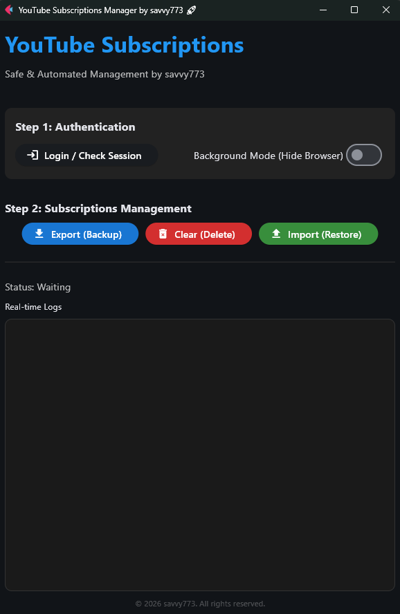

# YouTube Subscriptions Manager 🚀 (Safe & Modern)



A powerful automation tool based on **Playwright + Flet (GUI)** to safely manage your YouTube subscriptions. 

Easily backup hundreds of subscriptions, clear your account for a fresh start, and restore (import) them all at once. It features a **'Safe Mode'** with human-like delays to avoid account restrictions and a **'Background Mode'** for quiet execution.

---

## ✨ Key Features

-   **📥 Export (Backup):** Save all your currently subscribed channels to a `subscriptions.csv` file.
-   **🗑️ Clear (Delete):** Mass unsubscribe from all channels with a safe confirmation step.
-   **📤 Import (Restore):** Automatically re-subscribe to channels from a CSV backup.
-   **🛡️ Safe Mode:** Mimics human behavior with random delays and periodic breaks to prevent YouTube account flags.
-   **👤 Session Persistence:** Uses `user_data` to keep you logged in after the first manual authentication.
-   **🖥️ Background Mode:** Run tasks silently without the browser window popping up.
-   **📦 Window Persistence:** Automatically remembers and restores the last window position and size.

---

## 🛠 Installation

This project uses **`uv`**, the modern Python package manager.

```powershell
# 1. Install dependencies
uv sync

# 2. Install browser engine (first time only)
uv run playwright install chromium
```

---

## 🚀 Usage

Run the GUI application from your terminal:
```powershell
uv run yt-subs
```

1.  **Login:** If a login is required, the browser will pause automatically. Complete the login, and the automation will resume.
2.  **Safe Mode:** All operations are intentionally slowed down for account protection (approx. 20-30 mins for 200 channels).
3.  **Background Mode:** Use the toggle at the top if you want the browser to run hidden while you work on other tasks.

---

## 📂 Project Structure

-   `src/yt_subs/main.py`: Core automation logic and GUI (Flet & Playwright).
-   `pyproject.toml`: `uv` project configuration and dependencies.
-   `config.json`: Window state settings (auto-generated).
-   `subscriptions.csv`: Exported subscription data (auto-generated).
-   `user_data/`: Google login session data (**DO NOT upload to GitHub**).

---

## ⚠️ Disclaimer

1.  **Account Risk:** This tool uses automated means which are generally prohibited by YouTube's Terms of Service (ToS). Use of this tool may result in functional limits, temporary suspension, or permanent banning of your YouTube account. The developer is not responsible for any such consequences.
2.  **Use Safe Mode:** YouTube's detection algorithms change frequently. Always use the built-in delays provided by this tool.
3.  **Security Notice:** The `user_data` folder contains your active Google session. Never share this folder or upload it to public repositories like GitHub (it is already ignored by `.gitignore`).

---

## 👤 Author

-   **savvy773** - [GitHub Profile](https://github.com/savvy773)

---

## 📄 License

This project is licensed under the **MIT License**. See the `LICENSE` file for details.
