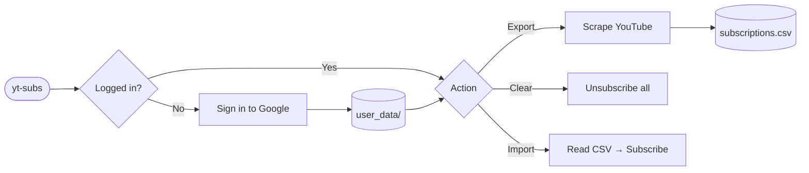

# YouTube Subscriptions Manager

> Backup, clean, and restore your YouTube subscriptions — safely and automatically.


---

## ✨ Features

| | Feature | Description |
|---|---------|-------------|
| 📥 | **Export** | Saves all subscribed channels to `subscriptions.csv` |
| 🗑️ | **Clear** | Mass unsubscribe with a confirmation prompt |
| 📤 | **Import** | Re-subscribes from a CSV backup |
| 🛡️ | **Safe Mode** | Human-like random delays to avoid account flags |
| 🕶️ | **Background Mode** | Runs the browser hidden |
| 🔑 | **Session Persistence** | Stays logged in after the first sign-in |

---

## 📦 Installation

> **No Python or Git required.** The installer handles everything automatically.

**Windows** — open PowerShell and run:

```powershell
irm https://github.com/savvy773/app-yt-subs-manager/releases/latest/download/install.ps1 | iex
```

**Linux / macOS** — open a terminal and run:

```bash
curl -fsSL https://github.com/savvy773/app-yt-subs-manager/releases/latest/download/install.sh | bash
```

<details>
<summary>What does the installer actually do?</summary>

```
 1. Install uv          — fast Python package manager (if not present)
 2. Install Python      — managed by uv, no system Python needed
 3. Download .whl       — app package from GitHub Releases
 4. Verify Blake3       — checksum check to ensure the file is intact
 5. uv tool install     — installs the app in an isolated environment
 6. playwright install  — downloads the Chromium browser for automation
```

</details>

---

## 🚀 Workflow



---

## 🖥️ Usage

Launch from any terminal after installation:

```sh
yt-subs
```

### Step 1 — Authenticate

Click **Login / Check Session**.
A browser window opens — sign in once, and the session is saved for all future runs.

### Step 2 — Choose an action

| Button | Action | Est. Time (200 channels) |
|--------|--------|--------------------------|
| 📥 Export | Scroll & scrape all subscriptions → CSV | ~5 min |
| 🗑️ Clear | Unsubscribe from all channels (confirm first) | ~30 min |
| 📤 Import | Re-subscribe from CSV | ~20 min |

### Tips

- ✅ Enable **Background Mode** after first login to run silently
- ⏳ Delays are intentional — do **not** close the app mid-operation
- 🔁 Run **Export first** before Clear, so you can always restore

---

## 📂 Local Files

```
your-working-directory/
├── subscriptions.csv   ← your channel backup (keep this safe!)
├── config.json         ← window position/size (auto-generated)
└── user_data/          ← Google session (⚠️ never share this)
```

---

## 🗑️ Uninstall

```sh
uv tool uninstall yt-subs
```

---

## ⚠️ Disclaimer

This tool automates actions on YouTube, which may conflict with YouTube's Terms of Service.
Use it at your own risk. The `user_data/` folder contains your active Google session — treat it like a password and never share it.

---

## 📄 License

[Apache 2.0](LICENSE) © 2026 savvy773
